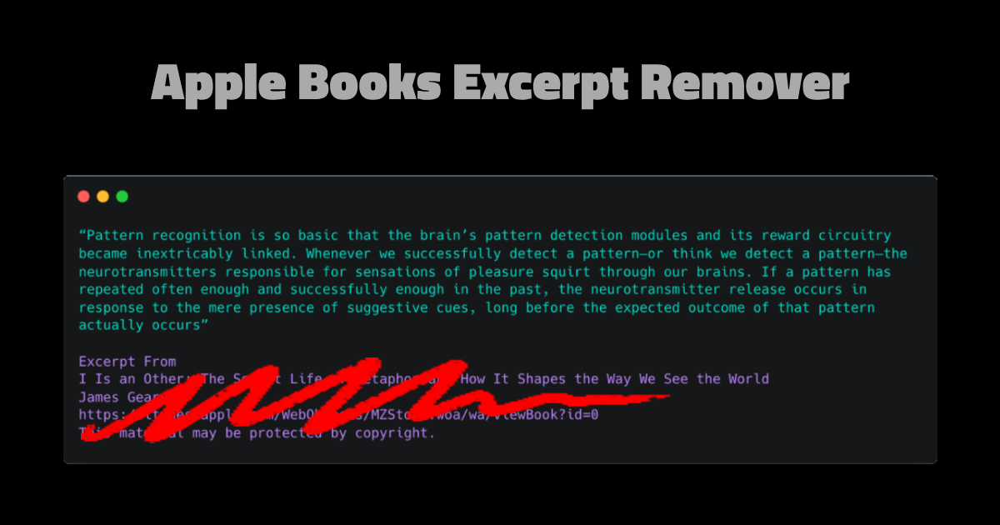

# Apple Books Excerpt Remover:

Apple Books Excerpt Remover is a simple web app designed to automatically process and clean up text copied from Apple Books, removing unnecessary excerpts in **no clicks** and copying the cleaned text directly to your clipboard.

Access the app at: https://xnivaxhzne.github.io/Apple-Books-excerpt-remover/

### App Interface

## How to Use

1. Copy text from Apple Books (or any source with unnecessary excerpts).
2. Paste the text into the input box.
3. The app will automatically clean the text and copy the result to your clipboard.
4. The processed text will also be displayed below for verification.
