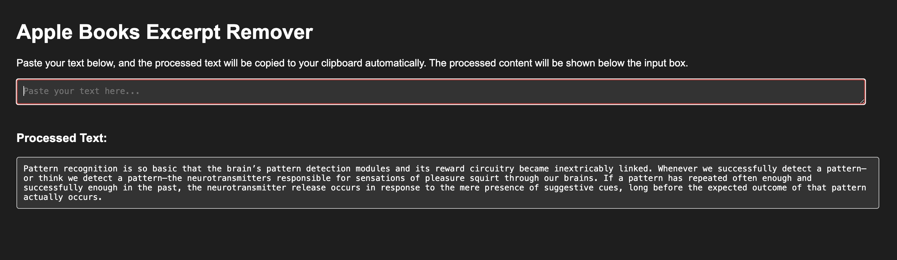
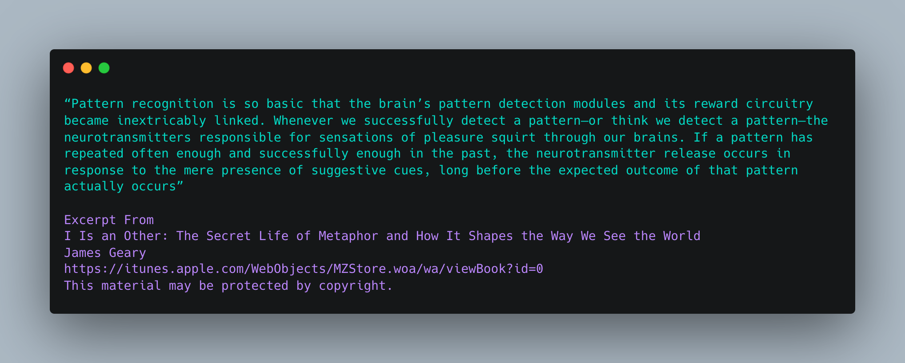
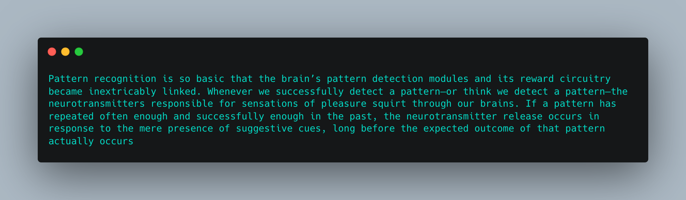

# Apple Books Excerpt Remover:

Apple Books Excerpt Remover is a simple web app designed to automatically process and clean up text copied from Apple Books, removing unnecessary excerpts in **no clicks** and copying the cleaned text directly to your clipboard.

## Features

- **Automatic Text Processing**: Simply paste text into the input field. The app detects and removes lines like `Excerpt From`, then copies the cleaned text to your clipboard instantly.
- **No-Click Workflow**: The app automatically processes the text and copies it to the clipboard without any additional steps.

## Screenshots

### App Interface

### Before and After

- **Before Processing**:  
  

- **After Processing**:  
  

## How to Use

1. Copy text from Apple Books (or any source with unnecessary excerpts).
2. Paste the text into the input box.
3. The app will automatically clean the text and copy the result to your clipboard.
4. The processed text will also be displayed below for verification.
